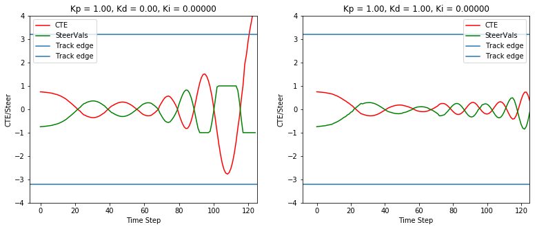
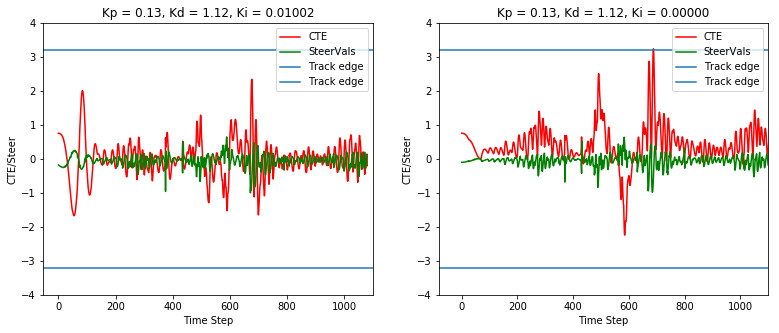
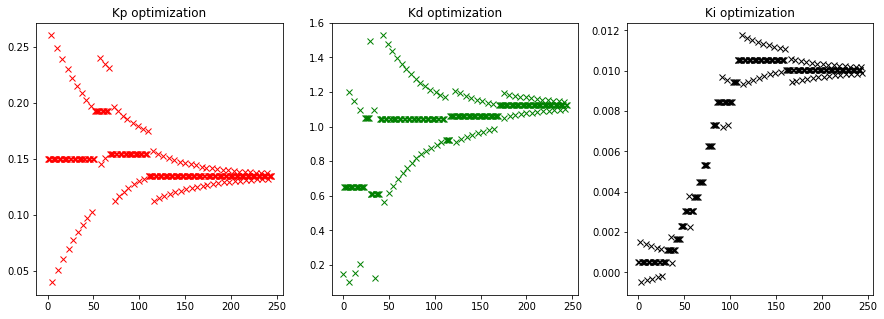

# Reflection

To start with, let's review the impact of the P, I and D coefficients

## Discussion of the P, I and D coefficients.
The P (proportional) coefficient introduces a correction that is proportional to the observed error. While this corrects the error, 
it tends to overshoot the target location and result in an error in the other direction. This results in oscillations around the intended track. 

The D (differential) coefficient introduces a correction proportional to the rate of change of error. It mitigates rapid changes of the direction/sign of the error and hence reduces oscillations. 

Below figure shows the impact of using only the P coefficient (Kp = 1) and compares it with using both the P and D coefficients (Kp=Kd=1). CTE is plotted for the first few time steps of the simulator. 

As expected, oscillations are much more severe without the D coefficient. Use of the differential controller significantly dampens the oscillations.

## Impact of the I coefficient

The I coefficient tends to eliminate accumulated bias in the cross track error.

Since the "scale" of the integral error was significantly different than the others, I was not able to play around with the I coefficient until the parameters were somewhat optimized for the car to navigate around the track. After optimization, I looked at the impact of the I coefficient. Left plot shows the error with optimized PID coeffients while the right plot shows the result with the same PD coefficent but with the I coefficent set to 0.

As understood, one has a certain bias in the CTE result if the Ki=0 but this bias is removed if Ki is a small non-zero value.

## Twiddle Optimization

I first used the twiddle algorithm to optimize the coefficients. After that, I manually adjusted the coefficients again based on 
how the car drove around the track.

The twiddle algorithm itself was an iterative process, where I went through certain coarse iterations to roughly gauge the operating values of the the three coefficents, Kp, Ki and Kd. Finally I ran the twiddle algorithm fully to arrive at the parameters.
* Unlike the video lectures, I started the algorithm at different initial values for the three parameters.
* I also used different initial setp sizes for the three parameters. 
 * These were based on estimates from the initial coarse iterations of twiddle
* I was also able to reset the simulator before stating with a new set of parameters during the twiddle algorithm
* Since the car frequently went off track and somestimes got stuck during the algorithm, I had an error condition that detected when the car went off track and assigned a high cost to this run. This cost was higher if the car went off track earlier.

The progression of the twiddle algorithm is visualized in terms of how the the three parameters evolved below. As can be seen, the
algorithm explores several step sizes and values for the three parameters. The range of exploration gradually reduces and converges to steady state values for the three parameters.

### Note:
It was seen that the algorithm (as well as the simulator laps) was sensitive to the computer that was used for the project. I got different results on a different desktop computer. This is likely due to the fact that the CTE as well as impact of our steering angles change based on simulator speed as well as the uWS interface. Hopefully this does not impact the project evaluation.

I used the simulator on two machines. I started with the output of the twiddle algorithm and manually adjusted the coefficients
to Kp = 0.33, Ki = 0.01, Kd = 4 which seemed to give satisfactory performance on both the machines.

